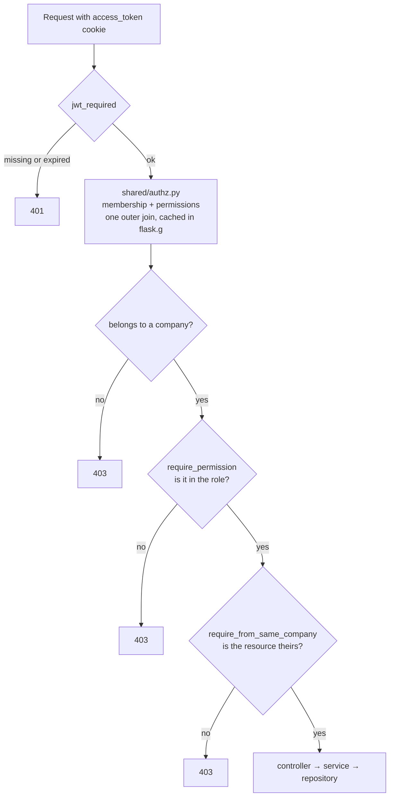
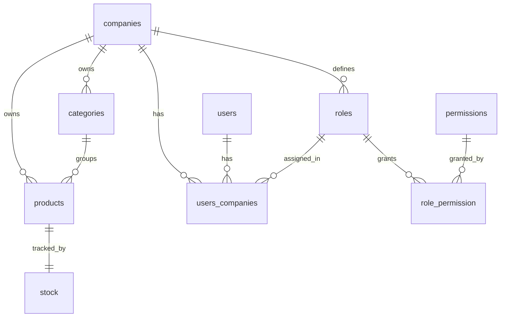

# Axis API

Axis is a stock management API for teams that share one system. A company signs up, brings in
its people with exactly the permissions each one needs, and runs its catalogue and inventory
from a single place — without ever seeing another company's data.


<!-- TODO: once deployed, put the live URL and the Swagger link right here, before anything
     else on the page:
     **[Live API](https://…)** · **[Interactive docs](https://…/apidoc/swagger)** -->

## ✨ Features

*   **Multi-Tenant by Design**: Every product, category, role and user belongs to a company.
    Two companies share the same database and never see a row of each other's data.
*   **Granular Permissions**: 24 permissions grouped into roles you define.
*   **Stock That Cannot Drift**: Each product carries exactly one stock row, created together
    with it. `IN STOCK`, `LOW STOCK` and `OUT OF STOCK` are derived from the quantity on every
    read and never stored, so the status is always the truth.
*   **Soft Delete**: Deactivating a product keeps its row, drops its stock to zero and takes it
    out of every listing. Nothing is erased.
*   **Search and Pagination**: Every listing is paginated, and products and categories are
    searchable by name.

## 🛠️ Tech Stack

*   **Language**: Python 3.13
*   **Framework**: Flask 3.1
*   **Database**: PostgreSQL
*   **Auth**: JWT in httpOnly cookies (Flask-JWT-Extended), Argon2 password hashing
*   **Validation & Docs**: Pydantic v2 and Spectree (OpenAPI)
*   **Runtime**: Waitress, with in-process rate limiting (Flask-Limiter)

## 🏗️ Architecture

The code is organised by domain. Each module owns its `entity` , `repository`, `service`, `model`, `controller`, `exceptions`, and an `interfaces` file holding the contract it exposes to the rest of the
system.

```
src/
├── app.py                  # Flask entry point: blueprints, handlers, lifecycle
├── container.py            # Composition root: every service is wired here
├── core/                   # Cross-cutting: extensions, logging, errors, health
├── shared/                 # Database, session, authz, config, base classes, seeds
├── auth/                   # Login, registration, token rotation
├── users/  users_companies/  companies/
├── roles/  permissions/  role_permissions/
└── categories/  products/  stock/

alembic/                    # Migrations
tests/
```

### Authorization

Three layers run before any controller does work:



Registration creates the company, an `OWNER` role holding all 24 permissions, and the
membership that links them. Every other user is created by that owner with a narrower role.

### Data model



`users_companies` is the membership table: it is what makes a user belong to a company *with a
role*, and every tenant check resolves through it. `stock` is one-to-one with `products`
(`product_id` is unique), so a product always has exactly one stock row, created alongside it.

## 🚀 Getting Started

### Requirements

*   Python 3.13+
*   [uv](https://docs.astral.sh/uv/)
*   A PostgreSQL database (a Neon connection string works)

### Installation

```bash
git clone https://github.com/Carril-fol/stocky-api-rest.git
cd stocky-api-rest

uv sync                        # creates .venv from uv.lock
cp .env.example .env           # then fill it in

uv run alembic upgrade head    # required: the app will not create the schema
cd src && uv run python app.py
```

The server listens on `http://127.0.0.1:8000` and seeds the 24 permissions on startup.

### Docker

```bash
docker compose up --build
```

The image runs `alembic upgrade head` before starting and reads `.env` from the project root.
Compose forces `FLASK_ENV=production` over that file, so the container runs with `DEBUG` off and
JWT CSRF protection on — cookie-authenticated writes need the `X-CSRF-TOKEN` header there.

### Environment variables

| Variable | Required | Description |
|---|---|---|
| `DATABASE_URL` | yes | PostgreSQL connection string |
| `SECRET_KEY` | yes | Flask session signing key |
| `JWT_SECRET_KEY` | yes | Signs the access and refresh tokens |
| `FLASK_ENV` | no | `development` (default) or `production`. Controls CSRF and cookie flags |
| `SERVER_HOST` | no | Bind address. Defaults to `0.0.0.0` |
| `SERVER_PORT` | no | Defaults to `8000` |
| `REDIS_URL` | no | Rate-limit storage. Defaults to `memory://` |

### Migrations

```bash
uv run alembic upgrade head                              # apply
uv run alembic revision --autogenerate -m "description"  # generate
```

## 📡 API Overview

37 endpoints. **Permission** is the string checked against the caller's role; endpoints without
one only need a valid session.

### Auth — `/auth/api/v1`

| Method | Path | Permission | Notes |
|---|---|---|---|
| POST | `/register` | public | Creates company + owner user. Returns an access token and sets its cookie. 3/hour |
| POST | `/login` | public | Sets access and refresh cookies. 5/min |
| POST | `/refresh` | refresh token | Rotates both tokens |
| POST | `/logout` | session | Clears the cookies |

### Companies — `/companies/api/v1`

| Method | Path | Permission | Notes |
|---|---|---|---|
| GET | `/detail/<company_id>` | owner only | Enforced in the service, not by a permission |
| PUT/PATCH | `/update/<company_id>` | owner only | Same |

### Company members — `/users/api/v1`

| Method | Path | Permission | Notes |
|---|---|---|---|
| POST | `/create-user-from-company` | `create_user` | Creates a user already assigned to a role |
| GET | `/get-users-from-company` | `read_user` | Paginated |
| PUT/PATCH | `/update-user-from-company/<id>` | `update_user` | Tenant-checked |
| DELETE | `/delete-user-from-company/<id>` | `delete_user` | Tenant-checked |

### Roles — `/roles/api/v1`

| Method | Path | Permission |
|---|---|---|
| POST | `/create-role` | `create_role` |
| GET | `/get-roles` | `read_role` |
| GET | `/get/<id>` | `read_role` |
| PUT/PATCH | `/update/<id>` | `update_role` |
| DELETE | `/delete/<id>` | `delete_role` |
| PATCH | `/assign-role` | `assign_role` |

### Role permissions — `/role-permissions/api/v1`

| Method | Path | Permission | Notes |
|---|---|---|---|
| GET | `/get/<role_id>` | `read_role_permission` | Permissions held by a role |
| POST | `/assign-permission-to-role` | `create_role_permission` | Accepts a list of permission ids |
| PUT/PATCH | `/update/<id>` | `update_role_permission` | `<id>` is the link row, not the role |
| DELETE | `/revoke?role_id=&permission_id=` | `delete_role_permission` | |

### Categories — `/categories/api/v1`

| Method | Path | Permission |
|---|---|---|
| POST | `/create` | `create_category` |
| GET | `/get/all` | `read_category` |
| GET | `/get/<id>` | `read_category` |
| GET | `/search/<name>` | `read_category` |
| PUT/PATCH | `/update/<id>` | `update_category` |
| DELETE | `/disable/<id>` | `delete_category` |

### Products — `/products/api/v1`

| Method | Path | Permission | Notes |
|---|---|---|---|
| POST | `/create` | `create_product` | Creates the product and its stock row |
| GET | `/get/all` | `read_product` | Paginated, `?search=` supported |
| GET | `/get/<id>` | `read_product` | Tenant-checked |
| GET | `/search/<name>` | `read_product` | |
| PATCH/PUT | `/update/<id>` | `update_product` | Tenant-checked |
| PATCH | `/deactivate/<id>` | `delete_product` | Soft delete; cascades the stock to 0 |

### Stock — `/stock/api/v1`

| Method | Path | Permission | Notes |
|---|---|---|---|
| GET | `/get/all` | `read_stock` | Stock joined with its product, paginated |
| GET | `/get/low` | `read_stock` | Below the low-stock threshold |
| GET | `/get/<id>` | `read_stock` | Tenant-checked |
| PUT/PATCH | `/update/<id>` | `update_stock` | Quantity cannot go negative |

### Health

| Method | Path | Notes |
|---|---|---|
| GET | `/health` | Public. Checks the database connection |

### Errors

Every error is JSON, never HTML:

```json
{ "error": "Product not found" }
```

| Status | When |
|---|---|
| 400 / 422 | Request body fails Pydantic validation |
| 401 | Missing, expired or invalid token |
| 403 | No membership, missing permission, or a resource from another company |
| 404 | Resource does not exist |
| 409 | Conflicts with existing data (duplicate email, unique constraint) |
| 429 | Rate limit exceeded |
| 500 | Unhandled — logged with a traceback, opaque to the client |

Errors raised by the framework add a `detail` field.

### Rate limits

60 requests/minute and 1000/hour per IP by default, tightened on the sensitive ones: register
3/hour, login 5/minute, user creation 3/minute, user update and delete 5/hour, role-permission
changes 5/minute.

Storage is in-process (`memory://`) because the app runs as a single Waitress process. Set
`REDIS_URL` to move the counters to Redis when that stops being true — that is the only reason
this project would need a Redis container, so Compose does not run one.

### Example workflow

The API takes the token either as an httpOnly cookie or as an `Authorization: Bearer` header.
`-c cookies.txt` saves the cookie, `-b cookies.txt` sends it back.

**1. Register — creates the company and its owner**

```bash
curl -X POST http://localhost:8000/auth/api/v1/register \
  -H "Content-Type: application/json" -c cookies.txt \
  -d '{
    "user": {
      "first_name": "John",
      "last_name": "Doe",
      "email": "john@acme.com",
      "password": "secret123",
      "confirm_password": "secret123"
    },
    "company": {
      "name": "Acme Corp",
      "country": "Argentina",
      "address": "Av. Corrientes 1234"
    }
  }'
```

**2. Log in**

```bash
curl -X POST http://localhost:8000/auth/api/v1/login \
  -H "Content-Type: application/json" -c cookies.txt \
  -d '{"email": "john@acme.com", "password": "secret123"}'
```

**3. Create a product** — its stock row is created in the same transaction

```bash
curl -X POST http://localhost:8000/products/api/v1/create \
  -H "Content-Type: application/json" -b cookies.txt \
  -d '{
    "name": "Laptop Pro 15",
    "description": "High performance laptop",
    "category_id": 1,
    "quantity": 10
  }'
```

**4. Read the stock, product included**

```bash
curl http://localhost:8000/stock/api/v1/get/1 -b cookies.txt
```

## 🧪 Tests

Pytest against SQLite in memory, with the database wiped between tests — no PostgreSQL needed
to run them.

```bash
uv run pytest
uv run pytest -v
uv run pytest tests/stock -v
```

## 📄 License

MIT — see [LICENSE](LICENSE).
